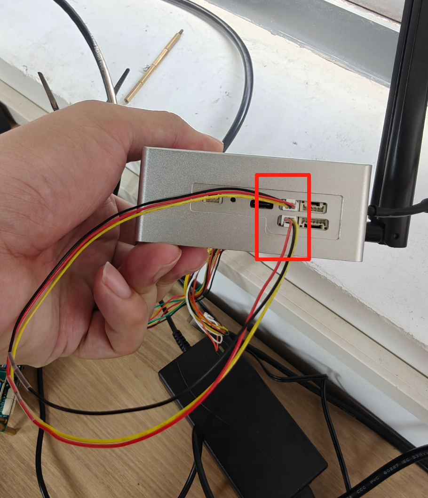

# Configuration
Refer to [this link](https://github.com/HuntersRobotics/ai_hunter_guideline/blob/main/97-guide/AI%20Hunter%20Guideline%20English.md) to configure the CAN interface parameters.

# Compile
```bash
git clone https://github.com/HuntersRobotics/ai_hunter_test.git
cd ai_hunter_test/CAN
mkdir build
cmake ..
make -j
```
> You will see the compiled generated send and receive executables

# Test
## Short-circuit can0 and can1

## Program sending, candump receiving
- First terminal
```bash
candump -X can1
```
> Detect data received by can1
- Second terminal
```bash
./send
```
> can0 sends a frame of data using the program

## Program receiving, cansend sending
- First terminal
```bash
./receive
```
- Second terminal
```bash
cansend can1 123#DEADBEEF