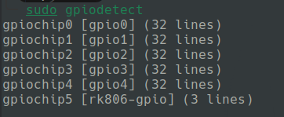
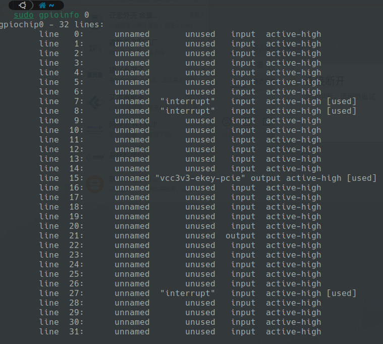
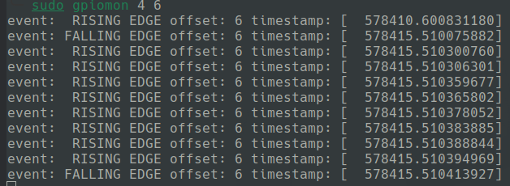

# Install Software
```bash
sudo apt install libgpiod-dev gpiod
```

# Command
- GPIO calculation example  

| PIN      | Controller | Port(order)| Index| Result| 
|----------|------------|--|--|--|
| GPIO4_A6 | 4          |A(0)|6|4 6(8x0 + 6)|


## gpiodetect 

## gpioinfo
 
## gpioset
Type "**gpioset 4 6=0**" or "**gpioset 4 6=1**" in the terminal, you can test GPIO4_A6 state.
## gpioget
```bash
watch -n1 sudo gpioget 4 6
```
## gpiomon
  
